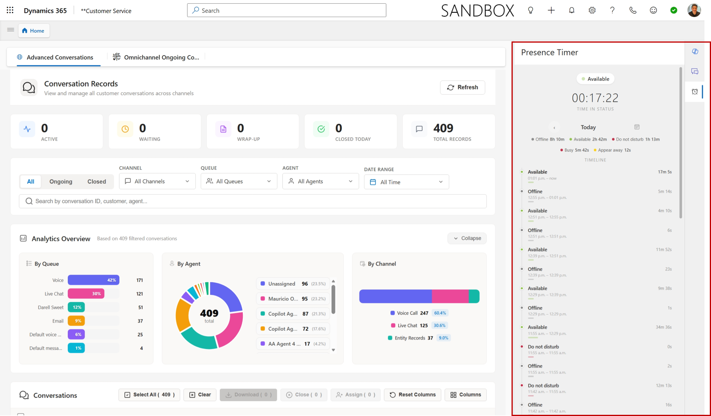

# ⏱️ Presence Timer

A PCF (PowerApps Component Framework) control for **Dynamics 365 Customer Service workspace** that displays the agent's current presence status with a live elapsed timer, a daily status history timeline, and a built-in date picker to review past days.



---

## ✨ Features

- **Live presence indicator** — colored dot + status name updated every 5 seconds
- **Elapsed timer** — counts up in `HH:MM:SS` since the last status change
- **Daily summary chips** — total time per status at a glance
- **Timeline view** — every status change for the selected day with duration bars
- **Date picker & calendar** — browse any past day's history
- Reads data from Dataverse tables (`msdyn_presence`, `msdyn_agentstatus`, `msdyn_agentstatushistory`) — **no external services required**

---

## 🚀 Installation

### Step 1 — Download the solution

1. Go to the [**Releases**](https://github.com/moliveirapinto/Presence-Timer/releases) page
2. Download the **Solution.zip** file from the latest release

### Step 2 — Import the solution into your environment

1. Open [make.powerapps.com](https://make.powerapps.com/)
2. Select the **environment** where Customer Service workspace is deployed
3. Go to **Solutions** in the left menu
4. Click **Import solution**
5. Click **Browse** and select the **Solution.zip** file you downloaded
6. Click **Next**, then **Import**
7. Wait for the import to complete — you'll see a success notification

---

## ⚙️ Add the Control to the Customer Service Productivity Pane

Once the solution is imported, follow these steps to make the Presence Timer visible to agents.

### Step 1 — Open Customer Service admin center

1. Go to [make.powerapps.com](https://make.powerapps.com/) and select your environment
2. Open the **Customer Service admin center** app (find it under *Apps* or use the app switcher)

### Step 2 — Navigate to Productivity Pane settings

1. In the left menu, go to **Workspaces**
2. Under the *Productivity pane* section, click **Manage**

### Step 3 — Enable the productivity pane (if not already enabled)

1. Make sure the **Productivity pane** toggle is turned **On**
2. Make sure **Turn on for all apps** is turned **On** (or enable it individually for the Customer Service workspace app)

### Step 4 — Add a new pane tool (custom control)

1. Still on the productivity pane settings page, scroll down to the **Application tab templates** or **Custom Productivity tools** section
2. You need to create an **Agent experience profile** or edit an existing one:
   - Go to **Agent experience profiles** under *Workspaces*
   - Select the profile assigned to your agents (or create a new one)
   - Under **Productivity pane**, click **Edit**
3. Click **+ Add** to add a new productivity tool
4. Set the following values:

   | Field | Value |
   |-------|-------|
   | **Name** | `Presence Timer` |
   | **Unique name** | `presence_timer_tool` |
   | **Type** | Custom (PCF control) |
   | **Control** | Search for and select **MauLabs.PresenceTimer** |

5. Click **Save and close**

### Step 5 — Verify it's working

1. Open the **Customer Service workspace** app
2. Look at the **right-side productivity pane** — you should see the Presence Timer panel
3. The control will show:
   - Your current presence status (e.g., Available, Busy, Away)
   - A live timer counting since the last status change
   - A timeline of today's status changes

> **Note:** The control reads from Dataverse, so agents need **read** access to the `msdyn_presence`, `msdyn_agentstatus`, and `msdyn_agentstatushistory` tables. This is included by default in standard Customer Service agent security roles.

---

## 🔧 Troubleshooting

| Problem | Solution |
|---------|----------|
| Control shows *"No agent status record found"* | The agent must have an active Omnichannel presence configured. Make sure Omnichannel for Customer Service is provisioned. |
| Control shows *"WebAPI not available"* | The control must run inside Customer Service workspace, not in a standalone model-driven app form. |
| Timeline shows *"No activity on this day"* | The `msdyn_agentstatushistory` table only has records for days when the agent was signed in. |
| Control doesn't appear in the productivity pane | Double-check that the agent experience profile with the custom tool is assigned to the correct users/teams. |

---

## 📁 Project Structure

```
Presence-Timer/
├── PresenceTimer/
│   ├── ControlManifest.Input.xml   # PCF control manifest
│   ├── index.ts                    # Main control logic
│   └── css/
│       └── PresenceTimer.css       # Styles
├── Solution/
│   ├── Solution.cdsproj            # Dataverse solution project
│   └── src/                        # Solution metadata
├── img/
│   └── Screenshot.png              # Preview image
├── package.json
├── tsconfig.json
└── Presence-Timer.pcfproj          # PCF project file
```

---

## 📄 License

[MIT](LICENSE) — Copyright (c) 2026 Mauricio Oliveira
